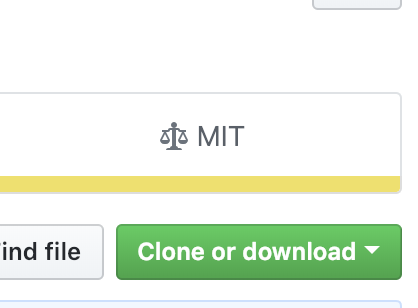
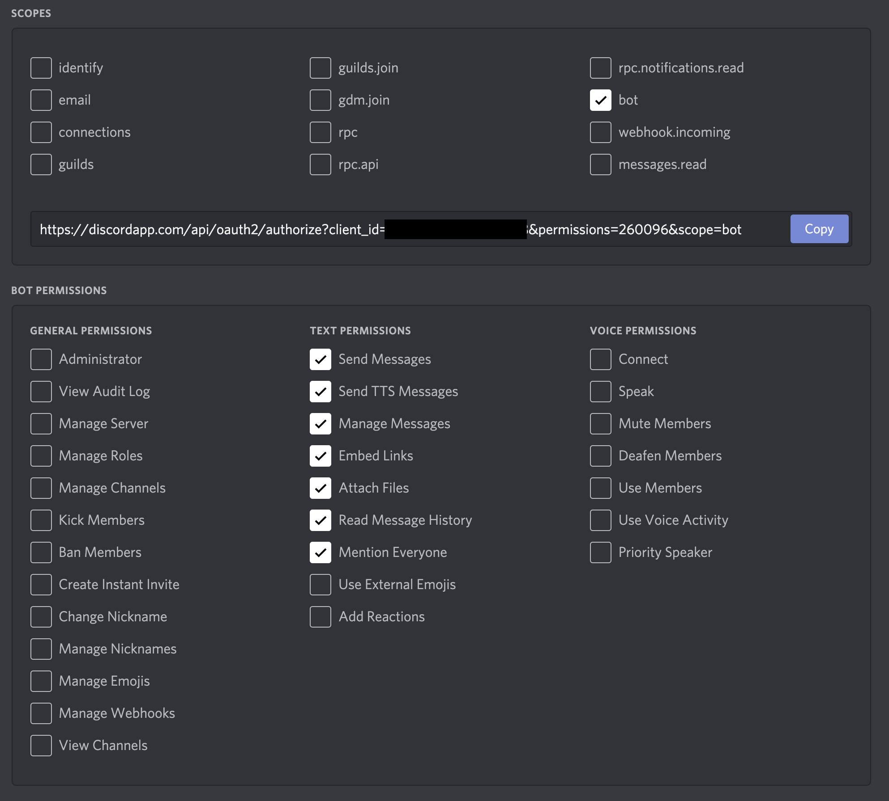
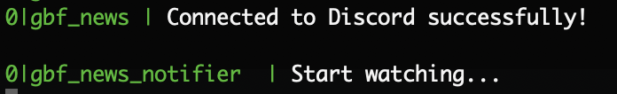

# セットアップ方法

## このリポジトリをcloneする

* gitでcloneするか普通にZIPでダウンロードする
  * gitでやるときは/opt/の下あたりがおすすめ
  * ZIPダウンロードは緑のボタンから
  


* 適当なところに展開する
  * Windowsならべつにどこでもいいと思う

## Discord botの作成・登録

* Discordのbotを登録する
  * 基本的にこの作業はDiscordサーバ管理者がやる
    * 普通は団長が管理者？
    * Discordで王冠マークついてる人が管理者
  * まずDiscord Applicationを作成する
    * 名前はなんでもいい
    * https://discordapp.com/developers/applications
  * Application作ったらbotアカウントを作る
    * 登録したApplication選んで左の「Bot」からアカウント作る
    * Botアカウント作ったら「Reveal Token」してトークンをコピーしておく
  * Botアカウントをサーバに招待する
    * 左の「OAuth2」メニューからOAUTH2 URL GENERATOR使う
    * scopesの「bot」にチェック入れる
    * すると下に設定項目が増えるので「TEXT PERMISSIONS」の列に全部チェック入れる
      * でもExternal EmojiとReactionはいらないかな……？
    * scopesのところにURL出てくるのでCOPYして開いて認証して終わり
      * サーバにbot参加したことを確認してね
      * botアカウントは名前の横にbotアイコンついてる
    


## サーバの準備

* botを動作させるサーバを準備する。WindowsでもmacでもLinuxでもいい
  * 専用サーバあったほうがいいけど、普段家で使ってるマシンでもいいよ
    * 常駐するからメモリとか食うけど
    * あと電源落としてたらもちろんその間は動作止まる……
  * うちの団ではさくらのVPSでCentOSサーバ借りてやってます
    * https://vps.sakura.ad.jp/
  * サーバない人はherokuとか使えばいい気もする
    * https://jp.heroku.com/
    
## サーバに環境整える

* Node.jsをインストールする。v10とかv11以上のやつを入れること。
  * Windowsなら公式サイトから落としてこればおk
  * macOSならbrewで入れられる
  * Linuxではそのままyumやaptで入れると古すぎるのが入る
    * 古いのだと動く保証がない
    * スクリプトを実行してからinstallすると新しいのが入る
      * 以下に書いてあるコマンド実行するだけ
      * https://github.com/nodesource/distributions/blob/master/README.md
      
* Linuxの場合
  * 内部的に使用しているChromeがそのままでは動作しない
  * CentOS, Debian（Ubuntu）の依存パッケージは公式ドキュメントに書いてあるので全部入れる
    * https://github.com/GoogleChrome/puppeteer/blob/master/docs/troubleshooting.md
  * 例えばCentOSなら以下のコマンドで依存関係入れる
  
```
yum -y install libX11 libXcomposite libXcursor libXdamage libXext libXi libXtst cups-libs libXScrnSaver libXrandr alsa-lib pango atk at-spi2-atk gtk3 
```

* pm2のインストール
  * Node.jsのプログラムを常駐させるやつ
  * sudo npm install -g pm2
  * こんだけ

### bot設定

`config.example.js` ファイルを `config.js` ファイルに名前変更。
中の値を編集する。

tokenはbotアカウントのトークン。
[Discord Application](https://discordapp.com/developers/applications/)ページの「Bot」から確認。

Reveal Tokenをクリックで表示される。


targetChannelNameは発言対象となるチャンネルの名前。シャープ抜きでの名前なのに注意。
例えば「#グラブル」チャンネルならtargetChannelNameは'グラブル'になる。

checkIntervalMsはチェック間隔（ミリ秒）。1000で1秒。60 * 1000で1分。
あんまり短いとサーバへの攻撃扱いされて蹴られると思うから注意ね。短くて3分が限度だと思う。

## 依存モジュールのインストール

これやらんと動かないから気をつけてね。

index.jsとかpackage.jsonとか入ってるディレクトリで以下のコマンドを実行

```
npm install
```

## 一時起動

一時的に起動させるならそのままnodeでindex.js叩く。

```
node index.js
```

こんだけ。終了するにはCtrl+C。

永続的に動かす場合は読み進めてくれ。

## 永続起動

rootユーザで起動させるのがいいと思う。

pm2使うので間違って読み飛ばした人はpm2のインストールのところまで戻って。

```
sudo su
pm2 start /opt/gbf_news_notifier_bot/index.js --name gbf_bot
pm2 startup
pm2 save
```

## ログ見る（動作確認）

```
sudo su
pm2 log
```



それっぽい文章が出てたら成功。

なんかエラー吐いてたら教えて。